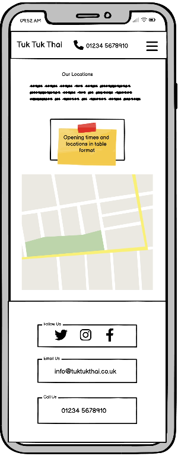
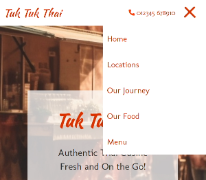
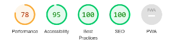

# **Tuk Tuk Thai**

## **Site Overview**
Tuk Tuk Thai is a street food truck, operating within Bristol's busy centre. Running for over a year without a website, they now want to create a web presence to help bring in new business and allow people to find out where they are, and a bit more about who they are.

# Table of contents 
1. [**Site Overview**](#site-overview)
1. [**(UX) User Experience**](#ux-user-experience)
    * [***Target Audiences***](#target-audiences)
    * [***User Stories***](#user-stories)
    * [***Site Aims***](#site-aims)
    * [***How This Will Be Achieved***](#how-is-this-will-be-achieved)
    * [***Wireframes***](#wireframes)
    * [***Colour Scheme***](#colour-scheme)
1. [**Current Features Common to all pages**](#current-features-common-to-all-pages)
    * [***Header Element:***](#header-element)
        * [*Logo*](#logos)
        * [*Navigation Bar*](#navigation-bar)
        * [*Phone Number*](#phone-number)
    * [**Anchor Tags Within all Pages Main Content**](#anchor-tags-within-all-pages-main-content)
    * [**Footer**](#footer)
    * [**Typography**](#typography)
    * [**Technologies Used**](#technologies-used)
1. [**Individual Page Features**](#individual-page-content-features)
    * [**Home Page Content**](#home-page-content)
    * [**Locations Page Content**](#locations-page-content)
    * [**Our Journey Page Content**](#our-journey-page-content)
    * [**Gallery Page Content**](#gallery-page-content)
1. [**Testing Phase**](#testing-phase)
    * [**During Development Testing**](#during-development-testing)
    * [**Manual Testing**](#manual-testing)
    * [**Bugs & Fixes**](#bugs-and-fixes)
    * [**Post Development Testing**](#post-development-testing)
1. [**Deployment**](#deployment)
1. [**Future Enhancements**](#future-enhancements)
1. [**Credits**](#credits)

## **(UX) User Experience**
### **Target Audiences:**
* The target audience has an age range of between 16 - 60 
* They are users who like to experience new or asian foods.
* They are users who live or work in Bristol.

### **User Stories:**
* As a new user, I want to easily see what the main subjet matter of the site is.
* As a new user, I want to easily navigate the site to find out more information.
* As a new user, I want to easily find out when and where I can find the food truck.
* As a returning user, I was to be able to navigate my way key areas of the site.
* As a returning user, I was quickly able to download the menu.
* As a returning user, I was able to quickly find the locations of the food truck and opening times. 

### **Site Aims:**
* To introduce the user to the Tuk Tuk Thai food truck.
* To inform the user when and where they can find the food truck.
* To inform the user of what is on offer at the food truck.
* To inform the user of the story behind the food truck.
* To offer the user a chance to connect to the food truck.
* Provide the user with visual images of the food and food truck.
* Provide a method by which the user can subscribe to a newsletter/offers to retain repeat buinsness.
* I expect the majority of users to be accessing the site via a mobile devices, the site will be built around a mobile layout and then adjusted using media queries to fit other device layouts.

### **How This Will Be Achieved:**
* The home page will have a large hero image showing a food truck to easily identify to the user what the site is about.

* The home page provides the user with a summary of the locations, the back story of the food truck and its owner and a way for the user to sign up for offers and to stay up to date.

* The site will provide multiple ways to contact the food truck such as 
    * A phone number.
    * Social links. 
    * Email address.

* The site will provide information what times the food truck is open and the locations around Bristol by
    * Displaying these points on the home page in a prominat position.
    * Clearly written on a locations page.
    * Pin points on a Google Maps image.

* The site will have a gallery page featuring photos from places and people around Thailand, and photos of some of the dishes served by the food truck. 

* The site will have a link to download a copy of the menu onto the users device in the form of a PDF.

* The site will have a sign up form at the bottom of the home page offering the user to join the newsletter to stay up to date and get offers helping to retain repeat business.

### **Wireframes**
The basic layout for the Tuk Tuk Thai website was designed using Balsamiq. Further wireframes can be found in the pdf.

* PC/Desktop Wireframes:  

* Tablet Wireframes: Due to the resolution of current tablets and the layout of the site. The standard desktop layout will work for tablet users.

* Phone Wireframes:  

### **Colour Scheme**
When deciding on the main colours to use throughout the site, I wanted to keep things simple and easily visible accross the site. I settled on an almost black and a range of oranges, using one as the main orange throughout the site. I choose orange to represet the spices commonly used in Asian cooking.

* Text - (Hex) #2c2c2c
* Headings, logo & links - (Hex) #DB3300

## **Current Features Common to all pages**
###  **Header Element**
* The header element sticks to the top of the page as the user scrolls up and down. I used this method to ensure the user always had easy of access to the menu as well as phone number.

#### *Logo:*
* The sites logo also doubles as the title for the business, it easily illustrates the business name and can easily be read and identified on the page.

* Keeping the logo in the same postion accross all devices ensures the name is always in a prominat location to the user.

#### *Navigation Bar:*
* The navigation bar appears on all pages. 
* It contains links to the 'locations', 'our journey', 'gallery' and menu to allow easy navigation around the website. 
* The user's current page will have the link underlined. 
* Hover over feature, which turns either underlines the hover link in desktop layout or highlights the link row in mobile layout.
* The phone number is also displayed in the header. Due to this being a potential main point of contact, this is set to always be displayed in line with the logo. In a desktop layout, it is situated on the right after the menu. In a mobile layout, this switches with the menu and is more central.
* The phone number uses a CallTo hyperlink, so if the user clicks the number while using a mobile device, it will automatically transffer the user to their phone app, with the number loaded.
* On a mobile layout the menu switches to a hamburger menu to ensure the logo and phone number can still fit along the top.

### **Anchor Tags Within all Pages** 
* All text achor tags have had their color set to match the sites colour scheme, meaning the anchor tag did not look out of place, and to help destiguish it as different from the standard text on the page.
* On a hover event the achonr tags also underline to help denote an embbeded hyperlink.
* The courser was left to change to the browsers default courser for hyperlinks.

### **Footer**
* The footer includes direct links to all of the social media accounts.

* These icons were imported from font awesome using a local copy of the stored css and fonts. I decided to use a local source instead of using links in order to prevent any changes made by font awesome from causing potential issue with the fonts being displayed properly.

* The email address is listed within the footer. This is a MailTo hyperlink, so clicking on it will automatically bring up the users default mail software.

* The phone number is also listed within the footer. This also uses a CallTo hyperlink in the same way the header phone number does.

* In a mobile screen layout, all three sections stack ontop each other to provide a cleaner UX.

### **Typography**
* Throughout the page, there are two main fonts used:
  * Kaushan Script - For the logo and headings to give it a strong presence.
  * Molengo - For all other content text. 
  * sans-serif & cursive - is used for a backup fonts if there is trouble rending the above fonts.

* All fonts were sourced from Google fonts, as stated in the credits.

### **Technologies Used**
This site was built using the following languages:
* HTML
* CSS

## **Individual Page Content features**
### **Home Page Content**

* This page features a hero image taking up 90% of the page making it known what the site is about.
* It has also has the name prominatly displayed, along with tag lines and an easily accessible menu link.
* This page has a small section above the fold to indicate to the user there is further content down the page. 
* This page has a summary, breifly detailing information about the food truck.
* Towards the bottom of the page is a signup form allowing the user to join the newsletter and get offers.

### **Locations Page Content**

* This page contains the opening times and locations of the food truck.
* It also has a Google Maps image with large pins showing where to find the food truck.

### **Our Journey Page Content**

* This page has the back story of the food truck, providing more indepth information on the history of the food truck and its owner.
* The text is broken up by pictures that relate to the story behind the food truck.

### **Gallery Page Content**

* This page has a collection of photos of food dishes from the menu and Thailand.
* The gallery has been made responsive for different devices.

## **Testing Phase**
### **During Development Testing**
During the development process, I continually carried out manual testing in the following ways:-

* Manually testing each element for appearance and responsiveness via a Google Chromes dev tools.

* Continually tested in multiple browsers.
    
* Published the page via a web hosted server and shared to friends and family to test.

### **Manual Testing:**
* During testing, I used five different browsers to ensure cross-compatibility. The desktop browsers used by myself were:

  1. Chrome
  2. Firefox  
  3. Opera
  4. Edge
  5. Safari

* I then used the devtools to simulate different screen sizes/devices from 320 px up to 4000px in width. 
* In addition to this, I also asked several people to test using iPhones and Apple Mac laptops/desktops. These users reported no issues or bugs.

### ***Bugs and Fixes:***

* **Issue** - Trying to use fontawesomes kit/javascript way of loading icons wasn't working. Only a square was being rendered on the site
* **Fix** - Downloaded and sourced the required fontawesome css file locally.

### **Post Development Testing**
#### **Validators**

#### ***HTML*** - https://validator.w3.org/nu/

* Home Page  

* Locations Page  

* Gallery Page  

* Journey Page  

#### ***CSS*** - https://jigsaw.w3.org/css-validator/

* CSS checked with the above CSS validator and no issues found

### **Lighthouse Scores**
### **Test conditions**

#### ***Desktop Version:***

* Home Page  

* Locations Page  

* Journey Page  

* Gallery Page  

#### ***Mobile Version:***

* Home Page  

* Locations Page  

* Journey Page  

* Gallery Page  

The major impact on the performance score accross all tests was the render-block resource from the loading of the fontawesome CSS file. Ideally this will be corrected once the ability to load the CSS file via Javascript or CDN.

The Gallery page also had a lower than average score, this was due to the number of images on the page. I have listed in future enhancements a couple of ways to improve this.

### **Accessability**

In addition to the accessability score on light house I also used [WAVE - Web accessability evaluation tool](https://wave.webaim.org/) to check my pages for accessability. There were some low contrast scores within two areas of the footer, however to keep the style of the page consistant I chose to leave these, as the information is also available elsewhere one the website.

## **Deployment**

* I have deployed the site on GitHub Pages using the following procedure:-

    1. From the project's [repository](https://github.com/isdanryan/TukTukThai), go to the **Settings** tab.
    2. From the left-hand menu, select the **Pages** tab.
    3. Under the **Source** section, select the **Main** branch from the drop-down menu and click **Save**.
    4. A message will be displayed to indicate a successful deployment to GitHub pages and provide the live link.

* The live site can be found via the following URL - [Tuk Tuk Thai live webpage](https://isdanryan.github.io/TukTukThai/index.html)

## **Future Enhancements**

* I would like to make the mail form fully functional, complete with a database to capture user details.
* I would also like to make the map pins on the Google Map image more interactive. Hovering or clickin on them would bring up the opening times for that location.
* Looking at some of the code, I would like to swap some of the html & css layout to make more use of the flex css style.
* I would like to implement some javascript within the gallery page to only load the images just before the fold, to better enhance page speeds for that page.

## **Credits**

* All content was written by myself and checked using gramerly - [Grammerly](https://www.grammerly)
* Icons used are from [Font Awesome](https://www.fontawesome.com)
* All fonts were imported from [Google Fonts](https://fonts.google.com/)
* All gallery images and our journey page images were downloaded from [Dreamstime](https://www.dreamstime.com)
* The hero image was from user stockgiu at [Vecteezy](https://www.vecteezy.com/photo/24928016-double-decker-bus-speeds-through-city-streets-selling-traditional-festival-meals-generated-by-ai)
* The inital idea and code for the hamburger menu is a modified version of Erik Terwan at [CodePen.io](https://codepen.io/erikterwan/pen/EVzeRP)
* Image modifications were done using [Gimp](https://www.gimp.org/)
* Color grid contrast tool - [Eightshapes](https://contrast-grid.eightshapes.com/) 
* With thanks to David Bowers [GitHUb](https://github.com/dnlbowers) - Code Institute Mentor who was great in offering advice and resources for this project.

